# machine_learning2

本阶段涉及内容如下

朴素贝叶斯
支持向量机(SVM)
EM算法
HMM模型

## [朴素贝叶斯](https://zsyll.blog.csdn.net/article/details/119062299)

基于概率进行预测 ,算法输出结果为样本属于某个类别的概率值


### 联合概率、条件概率与相互独立

- 联合概率：包含多个条件，且所有条件同时成立的概率
  - 记作：P(A,B)
- 条件概率：就是事件A在另外⼀个事件B已经发生条件下的发生概率
  - 记作：P(A|B)
- 相互独立：如果P(A, B) = P(A)P(B)，则称事件A与事件B相互独立。

#### 贝叶斯公式

$$
P(C|W) = \frac{P(W|C)P(C)}{P(W)}\\
注：w为给定文档的特征值（频数统计，预测文档提供），c为文档类别
$$

通过上述式子,可以得到给出文档的文档类别

- **朴素贝叶斯**，简单理解，就是假定了**特征与特征之间相互独立**的贝叶斯公式。

- P(C)：每个文档类别的概率(某文档类别数／总文档数量)
- P(W│C)：给定类别下特征（被预测文档中出现的词）的概率
- 计算方法：P(F1│C)=Ni/N （训练⽂档中去计算）
  - Ni为该F1词在C类别所有文档中出现的次数
  - N为所属类别C下的文档所有词出现的次数和
- P(F1,F2,…) 预测文档中每个词的概率


#### 例1.

 2.4.3 文章分类计算

**需求**：通过前四个训练样本（文章），判断第五篇文章，是否属于China类

|        | 文档ID | 文档中的词                          | 属于c=China类 |
| ------ | ------ | ----------------------------------- | ------------- |
| 训练集 | 1      | Chinese Beijing Chinese             | Yes           |
|        | 2      | Chinese Chinese Shanghai            | Yes           |
|        | 3      | Chinese Macao                       | Yes           |
|        | 4      | Tokyo Japan Chinese                 | No            |
| 测试集 | 5      | Chinese Chinese Chinese Tokyo Japan | ？            |

从上面的例子我们得到P(TokvolC)和P(JapanlC)都为O，这是不合理的，如果词频列表里面有很多出现次数都为0，很可能计算结果都为零。

##### 词频为0解决方法：拉普拉斯平滑系数

$$ P(F1|C) = \frac{Ni + \alpha}{N + \alpha m} $$

α为系数一般为1,m为训练文档中统计出的特征词总数
$$
P(C|Chinese, Chinese, Chinese, Tokyo, Japan) -->\\
P(Chinese, Chinese, Chinese, Tokyo, Japan|C) * P(C) / \\
P(Chinese, Chinese, Chinese, Tokyo, Japan) \\
=P^3(Chinese|C) * P(Tokyo|C) * P(Japan|C) * P(C) / \\
[P^3(Chinese) * P(Tokyo) * P(Japan)]
$$


```
公式如上
# 这个部分是需要计算是不是China类:

⾸先计算是China类的概率: 0.0003 
	P(Chinese|C) = 5/8 --> 6/14  (5+1)/(8+6) 下同 
	P(Tokyo|C) = 0/8 --> 1/14 
	P(Japan|C) = 0/8 --> 1/14

接着计算不是China类的概率: 0.0001 
	P(Chinese|C) = 1/3 -->(经过拉普拉斯平滑系数处理) 2/9 
	P(Tokyo|C) = 1/3 --> 2/9 
	P(Japan|C) = 1/3 --> 2/9
```

因此最后结果是China类


###  3. 案例：商品评论情感分析


#### 3.1 API介绍

- sklearn.naive_bayes.MultinomialNB(alpha = 1.0)
  - 朴素贝叶斯分类
  - **alpha**：拉普拉斯平滑系数

```python
data.loc[data.loc[:, '评价'] == '好评', '评论编号'] = 1
data.loc[data.loc[:, '评价'] == '差评', '评论编号'] = 0
```

上述代码:加一列'评论编号',如果'评价'=='好评',则'评论编号'的值为1;=='差评', '评论编号'的值为0

### 4. 朴素贝叶斯算法总结

#### 4.1 朴素贝叶斯优缺点

##### 优点：

朴素贝叶斯模型发源于古典数学理论，有**稳定**的分类效率
对**缺失数据不太敏感**，**算法简单**，常用于文本分类
分类**准确度高，速度快**

##### 缺点：

由于使用了**样本属性独立性**的假设，所以如果**特征属性有关联时其效果不好**
需要计算先验概率，而**先验概率很多时候取决于假设**，假设的模型可以有很多种，因此在某些时候会**由于假设的先验模型的原因导致预测效果不佳**；

##### 4.2.4 在估计条件概率P(X∣Y)时出现概率为0的情况怎么办？

解决这⼀问题的方法是采用贝叶斯估计, 即引入 λ

当**λ=0**时，就是普通的**极大似然估计**；
当**λ=1**时称为**拉普拉斯平滑**。

##### 4.2.5 为什么属性独立性假设在实际情况中很难成立，但朴素贝叶斯仍能取得较好的效果?

人们在使用分类器之前，首先做的第⼀步（也是最重要的⼀步）往往是特征选择，这个过程的目的就是为了**排除特征之间的共线性、选择相对较为独立的特征**；
对于分类任务来说，只要各类别的条件概率排序正确，无需精准概率值就可以得出正确分类；
**如果属性间依赖对所有类别影响相同，或依赖关系的影响能相互抵消，则属性条件独立性假设在降低计算复杂度的同时不会对性能产生负面影响。**

##### 4.2.6 朴素贝叶斯与LR(逻辑回归)的区别？

1）简单来说：

###### 区别⼀：

朴素贝叶斯是生成模型，
根据已有样本进行贝叶斯估计学习出先验概率P(Y)和条件概率P(X|Y)，
进而求出联合分布概率P(XY), 最后利用贝叶斯定理求解P(Y|X)，
而**LR是判别模型，**
**根据极大化对数似然函数直接求出条件概率P(Y|X)**；
从概率框架的⻆度来理解机器学习；主要有两种策略：
第⼀种：**给定 x， 可通过直接建模 P(c |x) 来预测 c，这样得到的是"判别式模型"** **(discriminative models)；**
第⼆种：**也可先对联合概率分布 P(x,c) 建模，然后再由此获得 P(c |x)， 这样得到的是"生成式模型"** **(generative models)** ;
显然，前⾯介绍的**逻辑回归、决策树、都可归入判别式模型**的范畴，还有后⾯学到的BP神经网络⽀持向量机等；

###### 区别二：

**朴素贝叶斯**是基于很强的**条件独立假设**（在已知分类Y的条件下，各个特征变量取值是相互独立的），
而**LR**则对此**没有要求**；

###### 区别三：

**朴素贝叶斯**适用于**数据集少**的情景，
而**LR**适用于**大规模数据集**。

**生成式模型和判别式模型的区别**

###### 生成式模型 (如朴素贝叶斯) :试图找出函数f

首先，Navie Bayes通过已知样本求得先验概率P(Y), 及条件概率P(X|Y), 对于给定的实例，计算联合概率，进而求出后验概率。也就是说，**它尝试去找到底这个数据是怎么生成的**（产⽣的），然后再进行分类。哪个类别最有可能产生这个信号，就属于那个类别。

优点： **样本容量增加时，收敛更快；隐变量存在时也可适用**。
缺点：**时间长；需要样本多；浪费计算资源**

###### 判别式模型 (如逻辑回归)  用已有数据修正拟合式 f

相比之下，**Logistic回归不关心样本中类别的比例及类别下出现特征的概率**，它**直接给出预测模型的形式**。设每个特征都有⼀个权重，**训练样本数据更新权重w**，得出最终表达式。

优点
直接预测往往**准确率更高**；
**简化问题**；
可以**反应数据的分布情况，类别的差异特征**；
**适用于较多类别的识别**。
缺点
**收敛慢；**
**不适用于有隐变量的情况**。


## 支持向量机(SVM)

#### 1. 定义

**寻找到⼀个超平⾯使样本分成两类，并且间隔最⼤。**

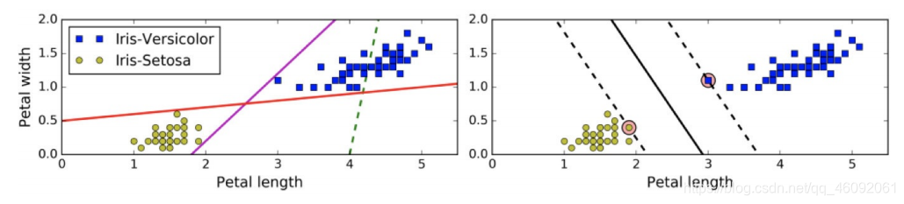

左图虚线表现显然不行,红粉两线离边界太近,效果不好。右图显然中间的实线表现最好

### 2 硬间隔和软间隔

##### 2.1 硬间隔

在上⾯我们使⽤超平⾯进⾏分割数据的过程中，如果我们**严格地让所有实例都不在最⼤间隔之间**，并且位于正确的一边，这就是硬间隔分类。

缺点:**硬间隔**只在**数据是线性可分离的时候才有效**；其次，**它对异常值非常敏感**

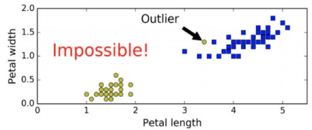

如上图,异常值导致难以找出合适的分割点

##### 2.2 软间隔

要避免这些问题，最好使⽤**更灵活的模型**。⽬标是尽可能在保**持最大间隔宽阔和限制间隔违例**（即位于最⼤间隔之上， 甚⾄在错误的⼀边的实例）之间找到良好的平衡，这就是软间隔分类。

在Scikit-Learn的SVM类中，可以通过**超参数C来控制这个平衡：C值越⼩，则间隔越宽，但是间隔违例也会越多**。

#### 3.SVM算法原理

T = {(x₁, y₁), (x₂, y₂), ... (xₙ, yₙ)}

xᵢ ∈ Rⁿ, yᵢ ∈ {+1, -1}, i = 1, 2, ... N₀₆₁

其中，(xᵢ, yᵢ) 称为样本点。

- xᵢ为第i个实例（样本），
- yᵢ为xᵢ的标记：
  - 当 yᵢ = 1时，xᵢ为正例
  - 当 yᵢ = -1时，xᵢ为负例

##### 3.2 线性可分支持向量机

原分割函数为 f(x)=w^T  x+b

给定了上面提出的线性可分训练数据集，通过**间隔最大化得到分离超平面**为：y(x)=wΦ(x)+b
相应的分类决策函数为：f(x)=sign(wΦ(x)+b)
以上**决策函数就称为线性可分支持向量机**。

Φ(x) 是某个确定的特征空间转换函数，它的作用是**将x映射到更高的维度**，它有一个以后我们经常会见到的专有称号”**核函数**“。

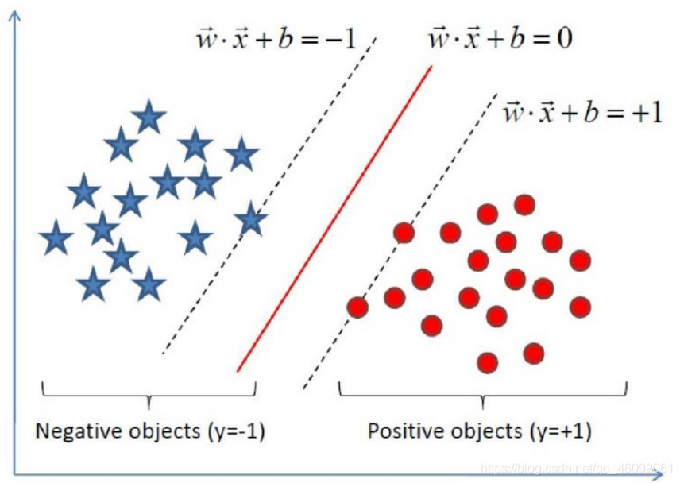

##### 3.3 SVM的计算过程与算法步骤

###### 3.3.1 推导目标函数

我们知道了⽀持向量机是个什么东⻄了。现在我们要去寻找这个⽀持向量机，也就是寻找⼀个最优的超平⾯。

于是我们要建⽴⼀个⽬标函数。那么如何建⽴呢？

样本空间中任意点到超平面(w,b)的距离可写成$$r = \frac{|{w}^T {x} + b|}{||{w}||}$$
$$
\begin{cases}
\boldsymbol{w}^{\mathrm{T}}\boldsymbol{x}_{i} + b \geqslant +1, & y_{i} = +1 \\
\boldsymbol{w}^{\mathrm{T}}\boldsymbol{x}_{i} + b \leqslant -1, & y_{i} = -1
\end{cases}
$$
如图所示，距离超平面**最近的几个训练样本点**使上式**等号成立**，**他们被称为“支持向量”**，

两个**异类支持向量到超平面的距离之和**为：$$\gamma = \frac{2}{\|w\|}$$

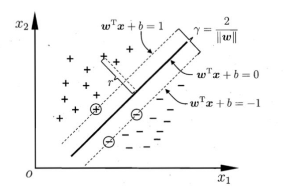

因此我们要求满足$$\begin{cases}
\boldsymbol{w}^{\mathrm{T}}\boldsymbol{x}_{i} + b \geqslant +1, & y_{i} = +1 \\
\boldsymbol{w}^{\mathrm{T}}\boldsymbol{x}_{i} + b \leqslant -1, & y_{i} = -1
\end{cases}$$的*w*和*b*,使得γ最大,即$$max_{w,b}\frac{2}{\|w\|}$$,其中$$ y_i \left( w^T x_i + b \right) \geq 1, i = 1, 2, \cdots, m $$ (各项预测均正确) ,故最大化$$\frac{1}{\|w\|}$$等价于最小化$$||w||^2$$
支持向量机的目标函数可以视为$$min_{x,b} \frac{1}{2}||w||^2$$ 1/2用于求导时便于计算


###### 3.3.2 目标函数的求解

⽬标函数带有⼀个约束条件，所以我们可以⽤**拉格朗日乘子法**,寻找多元函数在约束下的极值.

L=f+λg 其中g(x)=0是求解f最值的约束条件

经过朗格朗日乘子法，我们可以把目标函数转换为：

$$L(w, b, \alpha) = \frac{1}{2} \|w\|^2 + \sum_{i=1}^{n} \alpha_i (1 - y_i (w^T \cdot \Phi(x_i) + b) )$$

其中，要想求得极小值，上式后半部分：

$$\sum_{i=1}^{n} \alpha_i (y_i (w^T \cdot \Phi(x_i) + b) - 1) = 0$$,这是之前的条件得到的

走到这一步，这个目标函数还是不能开始求解，**现在我们的问题是极小极大值问题**。

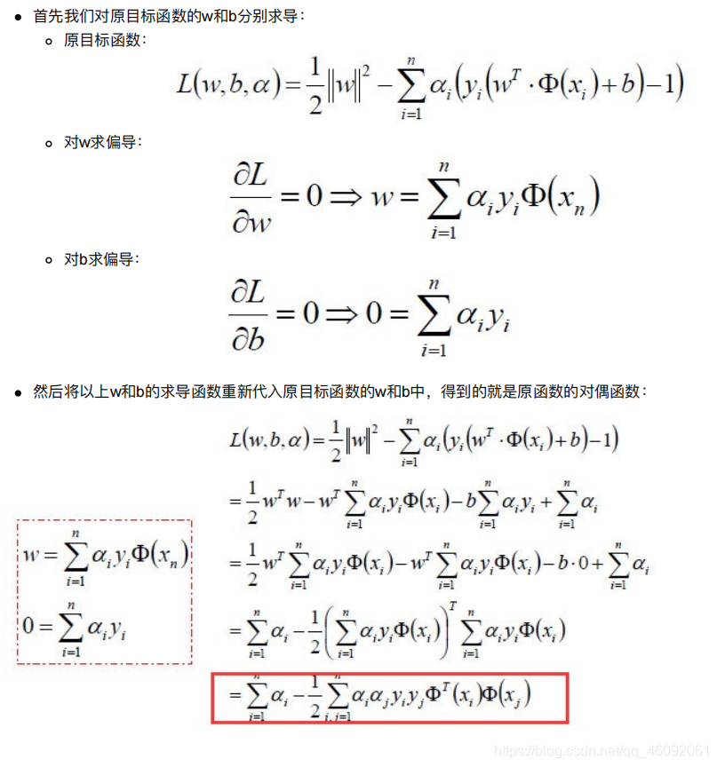

建议手写一下,这部分就是求偏导=0 然后代回原式即可求得w和b

### 4. SVM的损失函数

在SVM中，我们主要讨论三种损失函数：0/1损失  SVM Hinge损失和Logistic损失函数 如下图

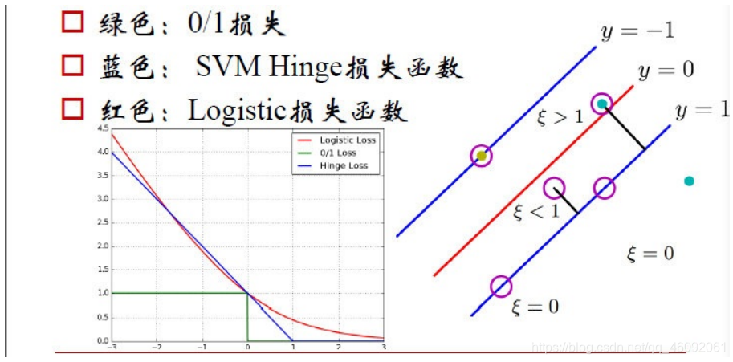

- 绿色：0/1损失
  - 当**正例的点**落在y=0这个超平面的下边，说明是**分类正确**，无论距离超平面所远多近，**误差都是0**.
  - 当这个正例的样本点落在y=0的上方的时候，说明**分类错误**，无论距离多远多近，**误差都为1**.
  - 图像就是上图绿色线。
- 蓝色：[SVM Hinge损失函数(折页损失)](https://blog.csdn.net/m0_37730034/article/details/81940023) (svm最常用)
  - API :`from sklearn.metrics import hinge_loss`
  - 要求**分类正确且离分割面距离越大越好**
  - 当一个**正例的点**落在y=1的直线上，**距离超平面长度1**，那么**1-ξ=1，ξ=0，也就是说误差为0**；
  - 当它落在**距离超平面0.5**的地方，1-ξ=0.5，**也就是说误差为0.5**；
  - 当它落在**y=0上**的时候，距离为0，1-ξ=0，ξ=1，误差为1；
  - 当这个点落在**y=0的上方**，被误**分到了负例**中，**距离**算出来应该是负的，**比如-0.5，ξ=1.5误差为1.5.**
  - 以此类推，画在二维坐标上就是上图中**蓝色那根线**了。
- 红色：Logistic损失函数
  - 损失函数的公式为: $$ln(1 + e^{-yi})$$
  - 当`yi = 0`时，损失等于ln2,这样真丑，所以我们给这个损失函数除以ln2.
  - 这样到`yi = 0`时，损失为1，即损失函数过（0，1）点
  - 即上图中的红色线。

## 5. SVM的核方法

### 5.1 什么是核函数

#### 5.1.1 核函数概念

原理 :**将原始空间映射到新的特征空间**，从⽽，使得**原本**线性**不可分**的样本可能**在核空间可分**。

作⽤ : ⼀个**从低维空间到⾼维空间的映射**，⽽这个映射可以**把低维**空间中**线性不可分的两类点变成线性可分**的。

如下图所示

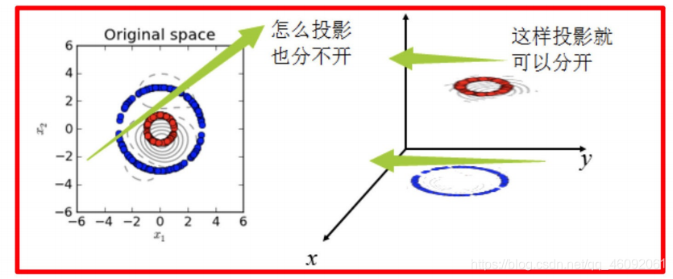

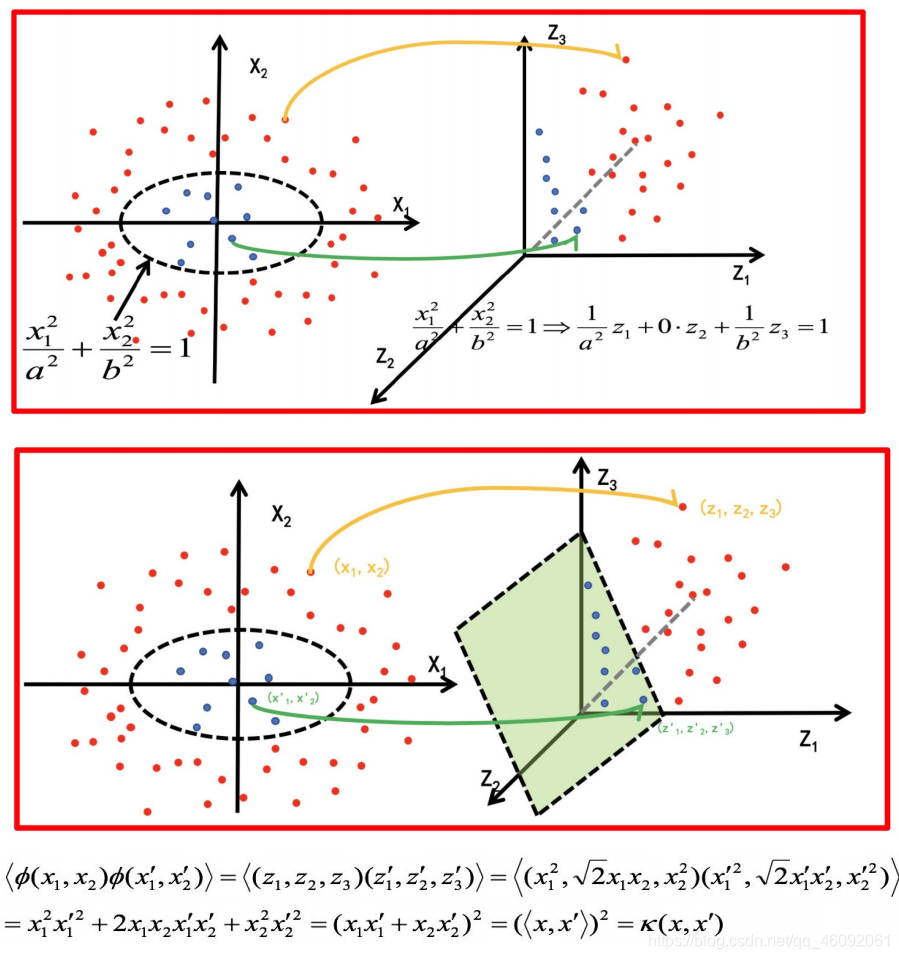

通过将二维的函数投射到三维,**使得原本不能线性分割的两类样本点变得线性可分**

### 5.2 常见核函数

| 名称       | 表达式                                      | 参数                              |
| ---------- | ------------------------------------------- | --------------------------------- |
| 线性核     | κ(𝑥𝑖, 𝑥𝑗) = 𝑥𝑖^T 𝑥𝑗                         |                                   |
| 多项式核   | κ(𝑥𝑖, 𝑥𝑗) = (𝑥𝑖^T 𝑥𝑗)^d                     | d ≥ 1 为多项式的次数              |
| 高斯核RBF  | $$κ(𝑥𝑖, 𝑥𝑗) = e^{(-||𝑥𝑖 - 𝑥𝑗||^2 / 2σ^2)}$$ | σ > 0 为高斯核的带宽(width)       |
| 拉普拉斯核 | κ(𝑥𝑖, 𝑥𝑗) = $$e^{-||x_i-x_j||/σ}$$          | σ > 0                             |
| Sigmoid 核 | κ(𝑥𝑖, 𝑥𝑗) = tanh(β𝑥𝑖^T 𝑥𝑗 + θ)              | tanh 为双曲正切函数, β > 0, θ < 0 |

- **线性核和多项式核：**
  - 这两种核的作用也是首先在属性空间中找到一些点，把这些点当做base,核函数的作用就是找与该点距离和角度满足某种关系的样本点。
  - 当**样本点与该点的夹角近乎垂直**时，两个样本的**欧式长度必须非常长才能保证满足线性核函数大于0**；而当**样本点与base点的方向相同时，长度就不必很长**；而当方向相反时，核函数值就是负的，被判为反类。即，它在空间上**划分出一个梭形**，按照梭形来进行正反类划分。
- **RBF核：**
  - 高斯核函数就是在属性空间中找到一些点，这些点可以是也可以不是样本点，**把这些点当做base,以这些base为圆心向外扩展，扩展半径即为带宽**，即可划分数据。
  - 换句话说，**在属性空间中找到一些超圆**，用这些超圆来判定正反类。
- **Sigmoid核**：
  - 同样地是定义一些base,
  - 核函数就是将线性核函数**经过一个tanh函数**进行处理，
    **值域限制在了-1到1**上。
- 总之，都是在定义距离，大于该距离，判为正，小于该距离，判为负。至于选择哪一种核函数，要根据具体的样本分布情况来确定。

般有如下指导规则：

-  1)如果**Feature的数量很大**，甚至和样本数量差不多时，往往线性可分，这时选用**LR或者线性核 Linear**; 
-  2)如果**Featurel的数量很小**，样本数量正常，不算多也不算少，这时选用RBF核；
- 3)如果**Feature的数量很小，而样本的数量很大**，这时**手动添加一些Feature**,使得线性可分，然后选用LR或者线性核Linear; 
- 4)**多项式核一般很少使用，效率不高**，结果也不优于RBF; 
- 5) **Linear核参数少，速度快；RBF核参数多，分类结果非常依赖于参数，需要交叉验证或网格搜索最佳参数，比较耗时**
- 6)**应用最广的应该就是RBF核**，无论是小样本还是大样本，高维还是低维等情况，**RBF核函数均适用**。

## 6. SVM回归

SVM回归是让尽可能多的实例**位于预测线上**，同时**限制间隔违例**（也就是**不在预测线距上的实例**）。(和svm分类正好相反

线距的宽度由超参数ε控制。


#### 使⽤SVM作为模型时，通常采⽤如下流程：

1. 对样本数据进⾏归⼀化

2. 应⽤核函数对样本进⾏映射（最常采⽤和核函数是RBF和Linear，在样本线性可分时，Linear效果要⽐RBF好）
3. ⽤cross-validation和grid-search对超参数进⾏优选
4. ⽤最优参数训练得到模型
5. 测试

sklearn中⽀持向量**分类**主要有三种⽅法：SVC、NuSVC、LinearSVC，

扩展为**三个**⽀持向量**回归⽅法**：SVR、 NuSVR、LinearSVR。

- SVC和NuSVC方法基本⼀致，唯⼀区别就是损失函数的度量⽅式不同
  - NuSVC中的nu参数和SVC中的C参数；
- LinearSVC是实现线性核函数的⽀持向量分类，没有kernel参数。

## 7. SVM算法API

### 7.2 SVC

```python
class sklearn.svm.SVC(C=1.0, kernel='rbf', degree=3,coef0=0.0,random_state=No
```

- C: 惩罚系数，⽤来控制损失函数的惩罚系数，类似于线性回归中的正则化系数。C越⼤ , 准确率⾼，但泛化能力弱
- kernel :核函数
  - 参数选择有RBF, Linear, Poly, Sigmoid或者⾃定义⼀个核函数。
    - 默认的是"RBF"，即径向基核，也就是⾼斯核函数；
    - ⽽Linear指的是线性核函数，
    - Poly指的是多项式核，
    - Sigmoid指的是双曲正切函数tanh核；。

- degree:
  - 当指定kernel为’poly’时，表示选择的多项式的最⾼次数，默认为三次多项式；
  - 若指定kernel不是’poly’，则忽略，即该参数只对’poly’有⽤。
    - 多项式核函数是将低维的输⼊空间映射到⾼维的特征空间。

- coef0: 核函数常数值(**y=kx+b中的b值**)，
  - 只有‘poly’和‘sigmoid’核函数有，默认值是0。

### 7.3 NuSVC

`class sklearn.svm.NuSVC(nu=0.5)`
nu： 训练**误差部分的上限**和**⽀持向量部分的下限**，取值在（0，1）之间，默认是0.5

### 7.4 LinearSVC

`class sklearn.svm.LinearSVC(penalty='l2', loss='squared_hinge', dual=True, C=1.0)`

- penalty:正则化参数，
  - L1和L2两种参数可选，仅LinearSVC有。
  - loss:损失函数，
  - 有hinge和squared_hinge两种可选，**前者⼜称L1损失，后者称为L2损失**，默认是squared_hinge，
  - 其中**hinge是SVM的标准损失**，**squared_hinge是hinge的平⽅**
- dual:是否**转化为对偶问题求解**，默认是True。
- C:惩罚系数，
  - ⽤来控制损失函数的惩罚系数，类似于线性回归中的正则化系数。

## 8. 案例：数字识别器 NMIST_demo

 [1_SVM_demo.py](1_SVM_demo.py) 代码mnist_demo函数


## EM算法

**EM算法**也称**期望最大化**（Expectation-Maximum,简称EM）算法。

EM算法是⼀种迭代优化策略，由于它的计算⽅法中每⼀次迭代都分两步，

- 其中⼀个为期望步（E步），
- 另⼀个为极大步（M步），

#### 流程

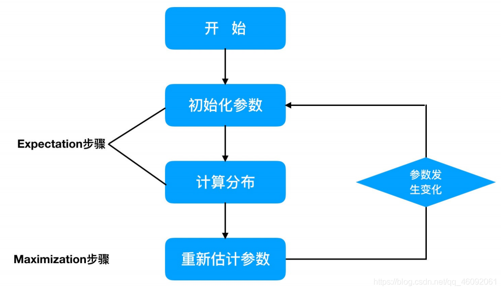

EM算法受到缺失思想影响，最初是为了**解决数据缺失情况下的参数估计问题**基本思想是：

1. ⾸先根据⼰经给出的观测数据，估计出模型参数的值；
2. 然后再依据上⼀步估计出的参数值估计缺失数据的值，再根据估计出的缺失数据加上之前⼰经观测到的数据重新再对参数值进⾏估计；
3. 重复1,2，直⾄最后收敛，迭代结束。

**极大似然估计是已知结果，寻求使该结果出现的可能性最大的条件， 以此作为估计值。**

极大似然函数取对数的原因

1. 

1. 概率连乘可能会出现浮点下溢
2. 乘法变加法方便计算
3. 对数函数也是单调增,对数最大点也是原函数最大的点

迭代⼀定会**更接近真实结果**,但**不一定会收敛**到真实结果(局部最优)


## HMM模型

### 1. 马尔科夫链

马尔科夫链**即为状态空间中从⼀个状态到另⼀个状态转换的随机过程。**

- 该过程要求具备“无记忆”的性质：
  - **下一状态的概率分布只能由当前状态决定**，在时间序列中它前面的事件均与之**无关**。这种特定类型的“**无记忆性**”称作马尔可夫性质。
- 马尔科夫链作为实际过程的统计模型具有许多应用。
- 在马尔可夫链的每一步，**系统根据概率分布**，可以从一个状态**变**到另一个状态，也可以**保持**当前状态。
- **状态的改变叫做转移，与不同的状态改变相关的概率叫做转移概率。**
- 马尔可夫链的数学表示为：$$P\left(x_{t+1}|\cdots,x_{t-2},x_{t-1},x_t\right)=P\left(x_{t+1}|x_t\right)$$

- 只要求出系统中**任意两个状态之间的转移概率**，这个马尔科夫链的模型就确定了。

  

- 状态概率转化图可以 以矩阵的形式表示。
- 如果我们**定义矩阵P某一位置P(i,j)的值为P(j,i)，即从状态改变的概率**。
- 另外定义状态分别为0、1、2，这样我们得到了**马尔科夫链模型的状态转移矩阵**为：

$$
P = \begin{pmatrix}
0.9 & 0.075 & 0.025 \\
0.15 & 0.8 & 0.05 \\
0.25 & 0.25 & 0.5
\end{pmatrix}
$$

当这个**状态转移矩阵P**确定以后，整个模型就已经确定！


### 2.  HMM简介

**隐⻢尔可夫模型**（Hidden Markov Model，**HMM**）是统计模型，它⽤来描述⼀个**含有隐含未知参数的马尔可夫**过程。 其难点是**从可观察的参数**中**确定该过程的隐含参数**。然后利⽤这些参数来作进⼀步的分析，例如模式识别。

#### 2.1 简单案例

下⾯我们⼀起⽤⼀个简单的例⼦来阐述：

假设我⼿⾥有三个不同的骰⼦。
第⼀个骰⼦是我们平常⻅的骰⼦（称这个骰⼦为D6），6个⾯，每个⾯（1，2，3，4，5，6）出现的概率是 1/6。
第⼆个骰⼦是个四⾯体（称这个骰⼦为D4），每个⾯（1，2，3，4）出现的概率是1/4。
第三个骰⼦有⼋个⾯（称这个骰⼦为D8），每个⾯（1，2，3，4，5，6，7，8）出现的概率是1/8。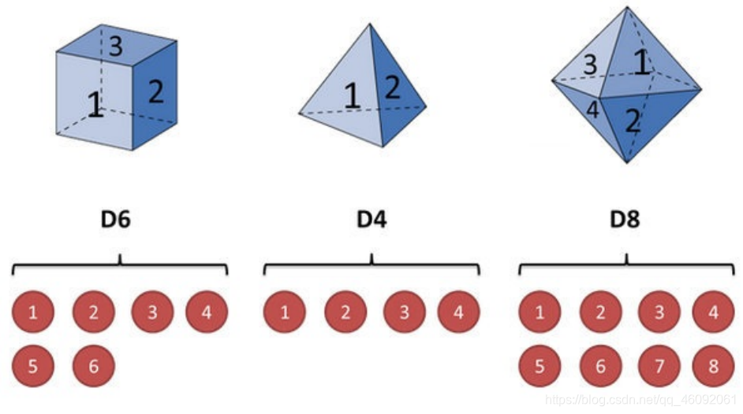

- 我们开始掷骰子，我们先从三个骰子里挑一个，挑到每一个骰子的概率都是1/3。
- 然后我们掷骰子，得到一个数字，1，2，3，4，5，6，7，8中的一个。不停的重复上述过程，我们会得到一串数字，每个数字都是1，2，3，4，5，6，7，8中的一个。
- 例如我们可能**得到这么一串数字**（掷骰子10次）：1635273524 , 这串数字叫做**可见状态链**。
- 但是在隐马尔可夫模型中，我们不仅仅有这么一串可见状态链，还有一串隐含状态链。在这个例子里，这串**隐含状态链就是你用的骰子的序列**。比如，隐含状态链有可能是：D6 D8 D8 D8 D8 D6 D4 D8 

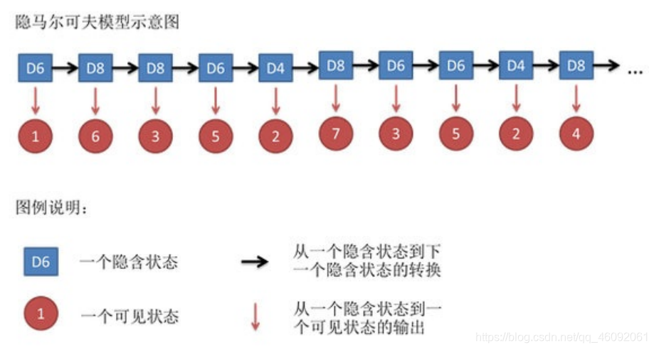

应⽤HMM模型时候呢，往往是缺失了⼀部分信息的。因此需要估计缺失信息


### HMM三种问题

和HMM模型相关的算法主要分为三类，分别解决三种问题：

1. **解码问题**

   **知道骰子有几种（隐含状态数量），每种骰子是什么（转换概率），根据挪骰子掷出的结果（可见状态链），我想知道每次掷出来的都是哪种骰子（隐含状态链）。**

- 这个问题其实有两种解法，会给出两个不同的答案。每个答案都对，只不过这些答案的意义不一样。
  - 第一种解法**求最大似然状态路径**，说通俗点呢，就是我求一串骰子序列，这串骰子序列产生**观测结果的概率最大**。
  - 第二种解法呢，就不是求一组骰子序列了，而是**求每次掷出的骰子分别是某种骰子的概率**。比如说我看到结果后，我可以求得第一次掷骰子是D4的概率是0.5，D6的概率是0.3，D8的概率是0.2。

2. **学习问题**

   还是知道隐含状态数量（骰子有几种），转换概率（每种骰子是什么），**根据可见状态链（骰子掷出的结果），我想知道挪出这个结果的概率**。
- 看似这个问题意义不大，因为你掷出来的结果很多时候都对应了一个比较大的概率。
- 问这个问题的目的呢，其实是**检测观察到的结果和已知的模型是否吻合**。
- **如果很多次结果都对应了比较小的概率**，那么就说明我们**已知的模型很有可能是错的**，有人偷偷把我们的骰子给换了。

3. **评估问题**

   **知道隐含状态数**（骰子有几种），**不知道转换概率**（每种骰子是什么），**观测到可见状态链**（多次挪骰子的结果），我想反推出转换概率（每种骰子是什么）。
- **这个问题很重要，因为这是最常见的情况。**
- 很多时候我们**只有可见结果，不知道HMM模型里的参数**，我们需要**从可见结果估计出这些参数**，这是建模的一个必要步骤。

上述三种问题**都需要知道隐含状态数**


##### 问题 1 最大似然求可能的骰子序列

这里我说的是第一种解法，解最大似然路径问题。

举例来说，我知道我有三个骰子，六面骰，四面骰，八面骰。我也知道我掷了十次的结果(1 6 3 5 2 7 3 5 2 4)，我不知道每次用了那种骰子，我想知道**最有可能的骰子序列**。

解决上述问题可以使用 :**维特比算法**（Viterbi algorithm）。要理解这个算法，我们先看一个简单的列子。

1. 不管序列多⻓，要从序列⻓度为1算起，**算序列长度为1时取到每个骰⼦的最大概率**。
2. 然后，逐渐增加⻓度，**每增加⼀次长度，重新算⼀遍在这个⻓度下最后⼀个位置取到每个骰⼦的最⼤概率**。因为上 ⼀个⻓度下的取到每个骰⼦的最大概率都算过了，重新计算的话其实不难。
3. 当我们**算到最后⼀位时**，就**知道最后⼀位是哪个骰子的概率最大**。
   然后，我们要**把对应这个最⼤概率的序列从后往前推出来**。


##### 2.2.2.3 谁动了我的骰子？【对应问题3】

怀疑有骰子被动手脚,即实际转换概率或者骰子结果不对,可以求出正常骰子出现该结果的概率和不正常时出现该结果的概率

暴力方法 : **计算每个骰⼦序列对应的概率**，但是这回，我们不挑最⼤值 了，⽽是把**所有算出来的概率相加**，得到的总概率就是我们要求的结果。这个⽅法依然不能应⽤于太长的序列（马尔可夫链）。 我们会应⽤⼀个和前⼀个问题类似的解法，只不过**前⼀个问题关⼼的是概率最大值，这个问题关⼼的是概率之和**。解决这个问题的算法叫做**前向算法**

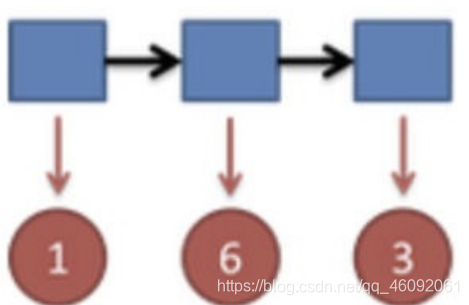

结果为1，6，3.产⽣这个结果的总概率可以按照如下计算，总概率为0.03：

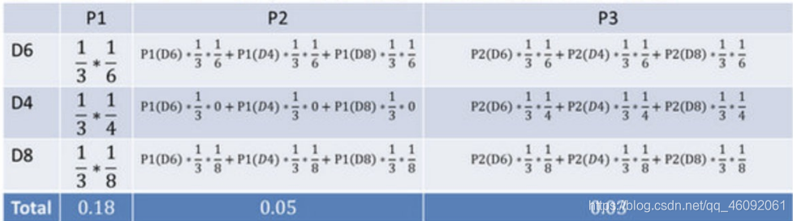

因此,通过上述方法可以在**O(NK)**的时间复杂度下算出**正常骰子**骰出三个数字**的概率**。⽤同样的⽅法，也可以**算出不正常**的六⾯骰和另外两个正常骰⼦掷出这段序列的概率，**然后我们⽐较⼀下这两个概率大小**，就能知道你的骰⼦是不是被换了。

- 常见术语
  - 可见状态链
  - 隐含状态链
  - 转换概率
  - 输出概率


## 3. HMM模型基础

### 3.1 什么样的问题需要HMM模型

首先我们来看看什么样的问题解决可以用HMM模型。使用**HMM模型**时我们的问题一般有这**两个特征**：

- 1）我们的问题是基于序列的，比如时间序列，或者状态序列。
- 2）我们的问题中有两类数据，
  - 一类序列数据是**可以观测**到的，即**观测序列**；
  - 而另一类数据是**不能观察到**的，即**隐藏状态序列**，**简称状态序列**。

有了这两个特征，那么这个问题一般可以用HMM模型来尝试解决。这样的问题在实际生活中是很多的。

- 比如：我现在给大家写课件，我在键盘上敲出来的**一系列字符就是观测序列**，而我**实际想写的一段话就是隐藏状态序列**，输入法的任务就是从敲入的一系列字符尽可能的猜测我要写的一段话，并把最可能的词语放在最前面让我选择，这就可以看做一个HMM模型了。

- 再举一个，假如我上课讲课，我发出的**一串连续的声音就是观测序列**，而我实际**要表达的一段话就是隐藏状态序列**，你大脑的任务，就是**从这一串连续的声音中判断出我最可能要表达的话的内容**。

### 3.2 HMM模型的定义

对于HMM模型，首先我们假设Q是所有可能的隐藏状态的集合，V是所有可能的观测状态的集合，即：

- $$Q = q_1, q_2, ..., q_N$$
- $$V = v_1, v_2, ... v_M$$

​	其中，N是可能的隐藏状态数，M是所有的可能的观察状态数。

对于一个长度为T的序列，i是对应的状态序列，O是对应的观察序列，即：

- $$i = i_1, i_2, ..., i_T$$
- $$O = o_1, o_2, ... o_T$$

其中，任意一个隐藏状态$i_t \in Q$，任意一个观察状态$o_t \in V$


###### HMM作了两个假设

1. **齐次马尔科夫链假设** 任意时刻的隐藏状态只依赖于它前一个隐藏状态。
2. **观测独立性假设**  任意时刻的**观察状态仅依赖于当前时刻的隐藏状态**


#### 例子1

状态转移概率分布A矩阵为：

$ A = \begin{pmatrix} 0.5 & 0.2 & 0.3 \\ 0.3 & 0.5 & 0.2 \\ 0.2 & 0.3 & 0.5 \end{pmatrix} $

观测状态概率B矩阵为：

$B = \begin{pmatrix}
0.5 & 0.5 \\
0.4 & 0.6 \\
0.7 & 0.3
\end{pmatrix}$

从上面的例子，我们也可以抽象出HMM观测序列生成的过程。

- 输入的是HMM的模型λ = (A, B, Π), 观测序列的长度T
- 输出是观测序列$O = O_1 ,O_2 ... O_n$

生成的过程如下：

1. 根据初始状态概率分布Π生成隐藏状态 
2. for t from 1 to T
    - a. 按照隐藏状态iₜ的观测状态分布bₜₜ(k)生成观察状态oₜ
    - b. 按照隐藏状态iₜ的状态转移概率分布aₜₜ, iₜ+1产生隐藏状态iₜ+₁

所有的oₜ一起形成观测序列O = o₁, o₂, ... oₜ

#### 3.5 HMM模型的三个基本问题

1) **评估观察序列概率**——前向后向的概率计算

- 即给定模型λ = (A, B, Π)和观测序列O = {o₁, o₂, ...oₜ}，计算在模型λ下某一个观测序列O出现的概率P(O|λ)。
- 这个问题的求解需要用到**前向后向算法**，是HMM模型三个问题中最简单的。


前向后向算法是**前向算法和后向算法的统称**，这两个算法都可以⽤来求HMM观测序列的概率。

##### 前向算法

本质上属于动态规划的算法，也就是我们要通过找到局部状态递推的公式，这样一步步的从子问题的最优解拓展到整个问题的最优解。

- 在前向算法中，通过定义“前向概率”来定义动态规划的这个局部状态。

- 什么是前向概率呢，其实定义很简单：定义时刻t时隐藏状态为$q_i$，观测状态的序列为$o_1, o_2, ... o_t$的概率为前向概率。
记为：
$$\alpha_t(i) = P(o_1, o_2, ... o_t, i_t = q_i | \lambda)$$

- 既然是动态规划，我们就要递推了，现在假设我们已经找到了在时刻t时各个隐藏状态的前向概率，现在我们需要递推出时刻t+1时各个隐藏状态的前向概率。

- 我们可以基于时刻t时各个隐藏状态的前向概率，再乘以对应的状态转移概率，即$\alpha_t(j) a_{ji}$就是在时刻t观测到$o_1, o_2, ... o_t$，并且时刻t隐藏状态$q_j$，时刻t+1隐藏状态$q_i$的概率。
$$\sum_{j=1}^{N} \alpha_t(j) a_{ji}$$
- 如果将下面所有的线对应的概率求和，即
就是在时刻t观测到$o_1, o_2, ... o_t$，并且时刻t+1隐藏状态$q_i$的概率。

- 继续一步，由于观测状态$o_{t+1}$只依赖于t+1时刻隐藏状态$q_i$，这样$$Σ_{i=1}^{N} α_t(j) a_ji] b_i(o_t+1)$$就是在时刻t+1观测到o_1, o_2, ... o_t, o_t+1，并且时刻$t+1$隐藏状态$q_i$的概率。

- 而这个概率，恰恰就是时刻t+1对应的隐藏状态i的前向概率，这样我们得到了前向概率的递推关系式如下：$\alpha_{t+1}(i)=\Big[\:\sum_{j=1}^N\alpha_t(j)a_{ji}\Big]b_i(o_{t+1})$我们的动态规划从时刻1开始，到时刻T结束，由于α_T(i)表示在时刻T观测序列为$$o_1, o_2, ... o_T$$，并且时刻T隐藏状态$$q_i$$的概率，我们只要将所有隐藏状态对应的概率相加，即   


$$
 \sum_{i=1}^{N}\alpha_{T}(i)
$$

为在时刻T观测序列为$o_1, o_2, ... o_t$的概率。此时算法时间复杂度为O(TN^2),远低于暴力的O(TN^T)

###### 前向算法运用实例

初始概率矩阵$$ \pi=(0.2 , 0.4 , 0.4) $$

状态转移概率分布矩阵为：

$$A=\begin{pmatrix}0.5&0.2&0.3\\0.3&0.5&0.2\\0.2&0.3&0.5\end{pmatrix}$$

观测状态概率矩阵为：

$$B=\begin{pmatrix}0.5&0.5\\0.4&0.6\\0.7&0.3\end{pmatrix}$$

球的顺序为  {0，1，0}

按照我们上一节的前向算法。首先计算时刻1三个状态的前向概率：
时刻1的值是0，

- 隐藏状态是盒子1的概率为：
  $\alpha_1(1) = \pi_1 b_1(o_1) = 0.2 \times 0.5 = 0.1$
- -隐藏状态是盒子2的概率为：

​		$ \alpha_1(2) = \pi_2 b_2(o_1) = 0.4 \times 0.4 = 0.16 $

- 隐藏状态是盒子3的概率为：
  $
  \alpha_1(3) = \pi_3 b_3(o_1) = 0.4 \times 0.7 = 0.28
  $


时刻2的值为1

- 隐藏状态是盒子1的概率为：$$\alpha_2(1) = \left[ \sum_{i=1}^{3} \alpha_1(i) a_{i1} \right] b_1(o_2) \\= [0.1 \times 0.5 + 0.16 \times 0.3 + 0.28 \times 0.2] \times 0.5 = 0.077$$


- 隐藏状态是盒子2的概率为：$$\alpha_2(2) = \left[ \sum_{i=1}^{3} \alpha_1(i) a_{i2} \right] b_2(o_2) \\= [0.1 \times 0.2 + 0.16 \times 0.5 + 0.28 \times 0.3] \times 0.6 = 0.1104$$

  

- 隐藏状态是盒子3的概率为：

$$\alpha_2(3) = \left[ \sum_{i=1}^{3} \alpha_1(i) a_{i3} \right] b_3(o_2) \\= [0.1 \times 0.3 + 0.16 \times 0.2 + 0.28 \times 0.5] \times 0.3 = 0.0606$$


时刻3的值为0

- 隐藏状态是盒子1的概率为：$$\alpha_3(1)=\Big[\sum_{i=1}^3\alpha_2(i)a_{i1}\Big]b_1(o_3)\\=[0.077*0.5+0.1104*0.3+0.0606*0.2]\times0.5=0.04187$$
- 隐藏状态是盒子2的概率为：$$\alpha_{3}(2)=\Big[\:\sum_{i=1}^{3}\alpha_{2}(i)a_{i2}\Big]b_{2}(o_{3})=\\ [0.077*0.2+0.1104*0.5+0.0606*0.3]\times0.4=0.0355.$$
- 隐藏状态是盒子3的概率为：$$\alpha_{3}(3)=\Big[\sum_{i=1}^{3}\alpha_{3}(i)a_{i3}\Big]b_{3}(o_{3})\\=[0.077*0.3+0.1104*0.2+0.0606*0.5]\times0.7=0.05284$$

最终我们求出观测序列为  {0，1，0} 的概率为$$P({\cal O}|\lambda)=\sum_{i=1}^{3}\alpha_{3}(i)=\,0.13022$$


后向算法搜索一下吧,时间复杂度与前向相同


2) 预测问题，也称为解码问题——维特比 (Viterbi) 算法

- 即给定模型λ = (A, B, Π)和观测序列O = {o₁, o₂, ...oₜ}，求给定观测序列条件下，最可能出现的对应的状态序列。
- 这个问题的求解需要用到基于动态规划的维特比算法，是HMM模型三个问题中复杂度居中的算法。

3) 模型参数学习问题——鲍姆-韦尔奇 (Baum-Welch) 算法(状态未知)，这是一个学习问题

- 即给定观测序列O = {o₁, o₂, ...oₜ}，估计模型λ = (A, B, Π)的参数，使该模型下观测序列的条件概率P(O|λ)最大。
- 这个问题的求解需要用到基于EM算法的鲍姆-韦尔奇算法，是HMM模型三个问题中最复杂的。


##### **维特比算法（Viterbi Algorithm）**

维特比算法是一种基于动态规划的高效算法，通过递推计算最优路径的概率并记录路径，时间复杂度为$$O(T*N^2)$$（N为状态数，T为观测序列长度


1. 第⼀个局部状态是在时刻t隐藏状态为i所有可能的状态转移路径i ,i , …i 中的概率最⼤值。

- 记为δ_t(i):


由δ_t(i)的定义可以得到δ的递推表达式:

$$δ_{t+1}(i) = max P(i_{t+1} = i, i_1, i_2, ... i_t, o_{t+1}, o_t, ... o_1 | λ)
i_1, i_2, ... i_t \\= max [δ_t(j) a_{ji}] b_i(o_{t+1})
1 ≤ j ≤ N$$

2) 第二个局部状态由第一个局部状态递推得到。

-  我们定义**在时刻隐藏状态为i的所有单个状态转移路径($$i_1, i_2, ..., i_ {t-1}$$)中概率最大的转移路径中第t-1个节点的隐藏状态为 $$ ψ_t(i) $$**

• 其递推表达式可以表示为:

$$Ψ_t(i) = arg max [δ_{t-1}(j) a_{ji}],1 ≤ j ≤ N$$

有了这两个局部状态，我们就可以从时刻0一直递推到时刻T，然后利用ψ_t(i)记录的前一个最可能的状态节点回溯，直到找到最优的隐藏状态序列。

1. 初始化:
   - 对每个状态 $i$，计算初始概率:
     $$
     \delta_1(i) = \pi_i \cdot b_i(o_1)
     $$
   - 路径记录 $\psi_1(i) = 0$。

2. 递推 (Recursion):
   - 对每个时间步 $t = 2, 3, ..., T$，计算**每个状态 $j$ 的最大概率和路径**:
     $$
     \delta_t(j) = \max_{1 \leq i \leq N} [\delta_{t-1}(i) \cdot a_{ij}] \cdot b_j(o_t)
     $$
     $$
     \psi_t(j) = \arg\max_{1 \leq i \leq N} [\delta_{t-1}(i) \cdot a_{ij}]
     $$

3. 终止:
   - 找到**最终时刻的最大概率和对应状态:**
     $$
     P^* = \max_{1 \leq i \leq N} \delta_T(i)
     $$
     $$
     i_T^* = \arg\max_{1 \leq i \leq N} \delta_T(i)
     $$

4. **i路径回溯 (Backtracking):**
   
   - **根据记录的 $\psi$ 回溯最优路径:**
     $$
     i_t^* = \psi_{t+1}(q_{t+1}^*) \quad (t = T - 1, T - 2, ..., 1)
     $$

###### 案例

初始概率矩阵$$ \pi=(0.2 , 0.4 , 0.4) $$

状态转移概率分布矩阵为：

$$A=\begin{pmatrix}0.5&0.2&0.3\\0.3&0.5&0.2\\0.2&0.3&0.5\end{pmatrix}$$

观测状态概率矩阵为：

$$B=\begin{pmatrix}0.5&0.5\\0.4&0.6\\0.7&0.3\end{pmatrix}$$

观测序列为{1 , 2 , 1 }

**按照维特比算法**，首先需要得到三个隐藏状态在时刻1时对应的各自两个局部状态，**此时观测状态为0**：

$$\delta_{1}(1)=\pi_{1}b_{1}(o_{1})=0.2\times0.5=0.1\\\delta_{1}(2)=\pi_{2}b_{2}(o_{1})=0.4\times0.4=0.16\\\delta_{1}(3)=\pi_{3}b_{3}(o_{1})=0.4\times0.7=0.28\\\Psi_{1}(1)=\Psi_{1}(2)=\Psi_{1}(3)=0$$


现在开始递推三个隐藏状态在时刻2时对应的各自两个局部状态，此时观测状态为2：
$$
\begin{aligned}&\bullet\:\delta_{2}(1)=\max_{1\leq j\leq3}[\delta_{1}(j)a_{j1}]b_{1}(o_{2})=\max_{1\leq j\leq S}[0.1\times0.5,0.16\times0.3,0.28\times0.2]\times0.5=0.028\\&\text{o}\:\Psi_{2}(1)=3\\

&\bullet\:\delta_{2}(2)=\max_{1\leq j\leq3}[\delta_{1}(j)a_{j2})b_{2}(o_{2})=\max_{1\leq j\leq1}[0.1\times0.2,0.16\times0.5,0.28\times0.3]\times0.6=0.0504\\
&\text{o}\:\Psi_{2}(2)=2

\\&\bullet  \:\delta_{2}(3)=\max_{1\leq j\leq3}[\delta_{1}(j)a_{j3}]b_{3}(o_{2})=\max_{1\leq j\leq3}[0.1\times0.3,0.16\times0.2,0.28\times0.5]\times0.3=0.042\\&\text{o}\:\Psi_{2}(3)=3\end{aligned}
$$
 

继续递推三个隐藏状态在时刻3时对应的各自两个局部状态，此时观测状态为1：
$$
\begin{aligned}&\bullet\:\delta_{3}(1)=\max_{1\leq j\leq3}[\delta_{2}(j)a_{j1}]b_{1}(o_{3})=\max_{1\leq j\leq3} [0.028\times0.0504\times0.3,0.042\times0.2]\times0.5=0.00756  \\&\circ\:\Psi_{3}(1)=2\\

&\bullet\:\delta_{3} (2)=\max_{1\leq j\leq3}[\delta_{2}
(j)a_{j2}]b_{2}
(o_{3})=\max_{1\leq j\leq3} [0.028\times0.0504\times0.5,0.042\times0.3]\times0.4=0.01008
\\&\circ\:\Psi_{3}(2)=2

\\&\bullet\:\delta_{3}(3)=\max_{1\leq j\leq3}[\delta_{2}(j)a_{j3})b_{3}(o_{3})=\max_{1\leq j\leq3}[0.028\times0.0504\times0.2,0.042\times0.5]\times0.7=0.0147\\&\circ\:\Psi_{3}(3)=3\end{aligned}
$$
根据上述结果开始回溯,此时最大概率为$$δ_3(3)$$，从而得到$$i_3^*$$=3
由于$$i_3^*$$=3，所以$$i_2^*$$=3，而又由于$$\Psi_{2}(3)=3$$，所以$$i_1^*$$=3。从而得到最终的最可能的隐藏状态序列为：(3,3,3)。

## 6. 鲍姆-韦尔奇算法简介

鲍姆-韦尔奇算法原理既然使用的就是EM算法的原理，

- 那么我们需要在E步求出联合分布P(O, I|λ)基于条件概率P(I|O, λ)的期望，其中λ为当前的模型参数，
- 然后在M步最大化这个期望，得到更新的模型参数λ。

接着不停的进行EM迭代，直到模型参数的值收敛为止。

首先来看看E步，当前模型参数为λ，联合分布P(O, I|λ)基于条件概率P(I|O, λ)的期望表达式为:

- $ L(λ, λ) = \sum P(I|O, λ) \log P(O, I|λ) $

在M步，我们极大化上式，然后得到更新后的模型参数如下：

-  $ λ = argmax\sum P(I|O, λ) \log P(O, I|λ) $

通过不断的E步和M步的迭代，直到λ收敛。


#### 代码实现上述例子

hmlearn实现了三种HMM模型类，按照观测状态是连续状态还是离散状态，可以分为两类。

GaussianHMM和GMMHMM是连续观测状态的HMM模型，而MultinomialHMM是离散观测状态的模型，也是我们在HMM原理系列篇里面使用的模型。

在这里主要介绍我们前面一直讲的关于离散状态的MultinomialHMM模型。

对于MultinomialHMM的模型，使用比较简单，里面有几个常用的参数：

- "startprob_"参数对应我们的隐藏状态初始分布II，
- "transmat_"对应我们的状态转移矩阵A，
- "emissionprob_"对应我们的观测状态概率矩阵B。


代码如下: [2_hmm_demo.py](2_hmm_demo.py) 

注意,0.2.8版本开始：The old MultinomialHMM class was renamed to CategoricalHMM ,因此使用CategoricalHMM来实例化模型

MultinomialHMM has undergone major changes. The previous version was implementing a CategoricalHMM (a special case of MultinomialHMM). This new implem entation follows the standard definition for a Multinomial distribution (e.g. as in https://en.wikipedia.org/wiki/Multinomial_distribution). See these issues for details:


# TODO

[链接](https://zsyll.blog.csdn.net/category_10993525.html)
[链接](https://blog.csdn.net/2201_75415080?type=blog)   

